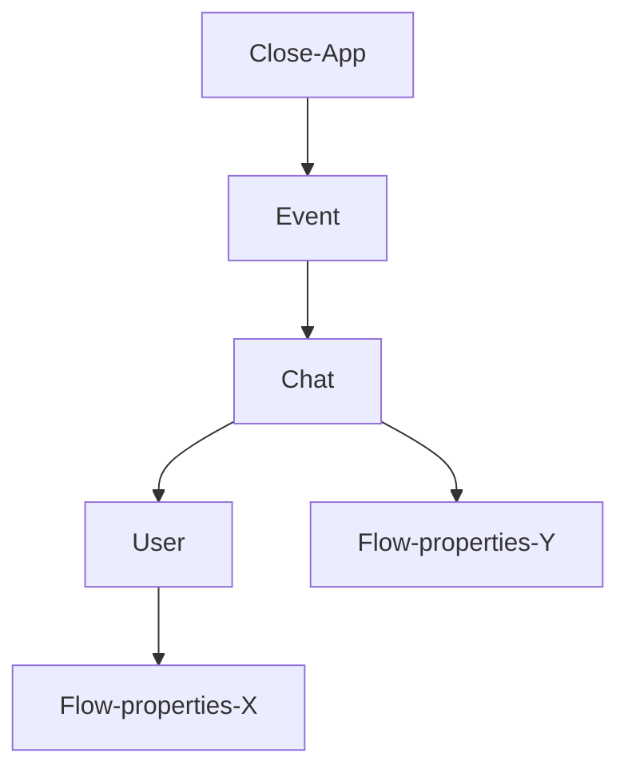

# Close PHP SDK user guide


In this Close PHP SDK user guide we will explain and demonstrate the use-cases you will encounter when partnering with the Close app. 


**Table of Contents:**    
  - [Getting Started](#getting-started)
  - [*Examples*](#examples)
    - [Authorise](#authorise)
    - [Send text Message](#send-text-message)
      - [To all users in all chats for an event](#to-all-users-in-all-chats-for-an-event)
    - [Import tickets using the Close App](#import-tickets-using-the-close-app)
  - [Getting Help](#getting-help)
  - [Features](#features)
  - [Contributing](#contributing)
  - [Resources](#resources)
  
---
###What is the Close app?
The Close app enables businesses to connect to their visitors/clients in a hyper-personalised way. Close started out in the event industry where we allow visitors to receive their tickets, practical information and live-updates all in one spot: The Close app. 

Using the Close PHP SDK you can easily integrate your APIs and systems with our messaging technology. 

###Close system overview

Useful terms:

| Term | Definition |
| -------- | ----------- |
|**EventID**| An ID to identify one specific event (show). Always starts with "CLEV".|
|**Ticketgroup**||
|**ChatID**|An ID to identify one specific chat for one specific event. Always starts with "CLEC".|
|**UserID**|An ID to identify one specific Close App user.|


### Getting Started

For now it is only possible to start using the Close PHP SDK by getting in touch with us first. Get in touch with your contact person at Close or [contact us][contact-us] directly. 

1. **Get your credentials** – Before you begin, you need to already have an account with Close. If that is not the case, feel free to [contact us][contact-us].
2. **Minimum requirements** – In order to use the Close SDK, your system will need to meet the [minimum requirements][docs-requirements], which includes having **PHP >= 7.4**.
3. **Install the SDK** – The recommended way to use the Close SDK is by installing it with [Composer][composer]:

   ```
   composer require close-dev-team/partner-sdk-php
   ```

4. **Using the SDK** – In this page you will learn how to use the SDK, but if you want to get more information about the calls, you can always see our [Close Partner API Documentation][partner-api-doc], which this SDK is a wrapper of.

---

## *Examples*


### Setting up the Close PHP SDK client.
Let's start with instantiating the Close client using the client credentials given to you by Close. 

```php
<?php
// Require the Composer autoloader.
require 'vendor/autoload.php';

use ClosePartnerSdk\CloseSdk;
use ClosePartnerSdk\Options;
use ClosePartnerSdk\Exception\CloseSdkException;

try {
  // Instantiate the Close client using the client credentials given by Close
  $sdk = new CloseSdk(
       new Options([
            'client_id' => 'client_test',
            'client_secret' => 'client_test_secret',
       ])
  );
} catch (CloseSdkException $closeSdkException) {
    // You can receive an error if the token was not generated because of invalid credentials
}

```
Now that you have the Close Client setup you're ready to continue.

### TextMessage()
One of the core features of the Close PHP SDK is sending ultra personalised text messages to Close users. There are 4 operations available in the TextMessageOperation class, with each a different use-case. 

| Operations | Use-case |
| -------- | ----------- |
|**sendToAllChatsForEvent(eventId, text)**| Use when you need to reach all users for an event|
|**sendToAllUsersForChat(eventId, chatId, text)**|Use when you need to reach all users in one specific chat for an event |
|**sendToUserInChat(eventId, chatId, userId, text)**|Use when you need to reach one specific user, in a specific chat for an event|
|**toUserInAllChats(eventId, userId)**|Use when you need to reach one specific user in all chats for one event|

#### sendToAllChatsForEvent(eventId,text)


### ticket()
The Close app can be used to provide digital tickets to event-visitors. Using the Close PHP SDK you can both import and cancel tickets. 


| Operation | Use-case |
| -------- | ----------- |
|**import(eventId,ticketgroup)**| Use when you want to import a ticket.|
|**cancel(eventId, ticketCancelDto)**|Use when you want to cancel a ticket.|

*Code examples:*
#### import(eventId,ticketgroup)

#### cancel()

### flowproperty()
In order to create a personalised messaging experience it can be needed to set or get a custom property for a user or event. You can do this using the flowproperty operations.


| Operation | Use-case |
| -------- | ----------- |
|**setForOneUserInOneChat(eventId,chatId, userId, itemFlowProperties)**| Set a property for one specific user in one specific chat for an event.|
|**setForAllUsersInAllChats($eventId, $itemFlowProperties)**|Set a property for all users in all chats for an event.|
|**setForUserInAllChats(eventId, userId, itemFlowProperties)**|Set a property for one specific user in all chats for one specific event.|
|**getProperties(eventId, chatId, userId)**|Get an overview of all flowproperties of a specific user, in a specific chat for an event.|
|**render(eventId, chatId, userId, text)**|-|

## Getting Help

Feel free to let us know if you have encountered any questions or problems using our SDK. We will try to make sure that we will get back to you as soon as possible.

* If you have questions that have not been answered in this documentation, please [contact us][contact-us].
* If you think that you may have found a bug, feel free to [open an issue][open-issue].

## Features

* Provides a very easy way to communicate with our [partner API][partner-api-doc] for all of the supported endpoints. This means that we always fetch the correct data based on your API credentials.
* It is built on the latest software, with the highest security standards and following the [PSR conventions][PSR].
* We use [Guzzle][guzzle] to generate these requests and we make use of its technology (async requests, middlewares, etc.).
* We provide a data structure of our domain that can be easily used by external PHP applications.
* We give back clear responses and exceptions in case something doesn't go as expected.

## Contributing

If you have ideas on how to improve our SDK, don't hesitate to [open an issue][open-issue] and let us know! 
If you already have code ready that would help us improve our system, you are free to [open a PR][open-pr]. All the extra help is highly appreciated!

## Resources

* [API Docs][partner-api-doc] – For more details about the parameters of each endpoint, validation and responses.
* [Website][the-close-app] – More information about Close and what we do.
* [Issues][open-issue] – Report issues and submit pull requests.
* [License][apache-license] – More information about our license.

[contact-us]: devteam@thecloseapp.com
[partner-api-doc]: https://partner.closeapi.nl/api/documentation
[apache-license]: https://www.apache.org/licenses/LICENSE-2.0
[PSR]: https://www.php-fig.org/psr/

[open-issue]: https://github.com/close-dev-team/partner-sdk-php/issues/new/choose
[open-pr]: https://github.com/close-dev-team/partner-sdk-php/compare

[the-close-app]: http://thecloseapp.com
[guzzle]: http://guzzlephp.org
[composer]: http://getcomposer.org

