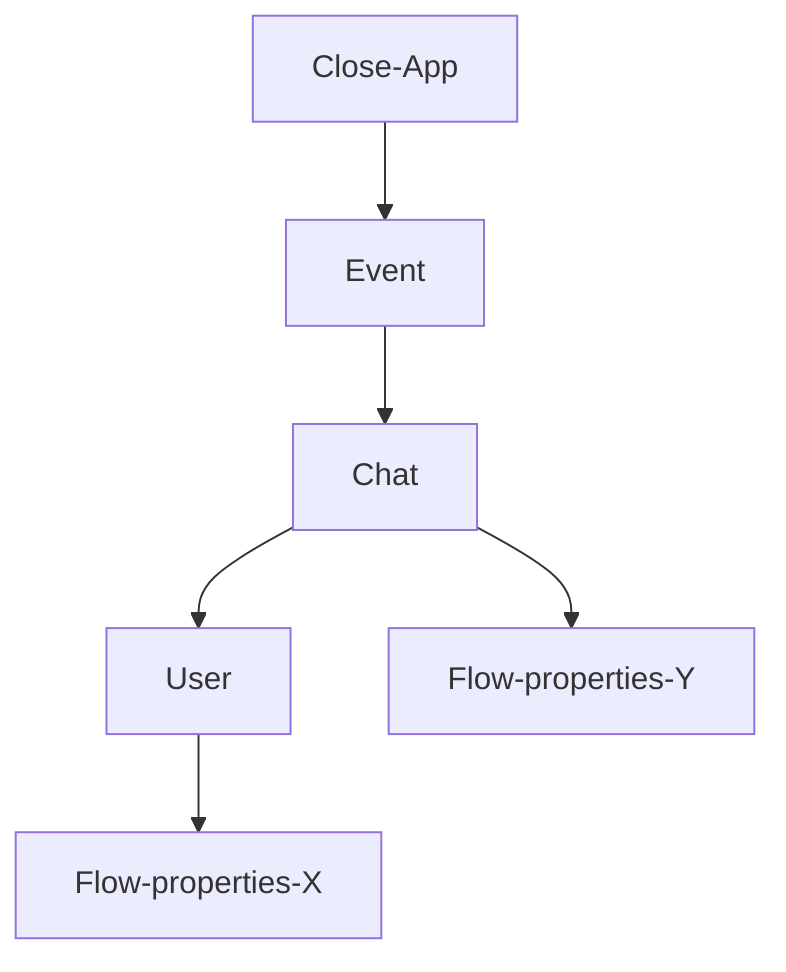

# Close PHP SDK user guide
In this Close PHP SDK user guide we will explain and demonstrate the use-cases you will encounter when partnering with the Close app and their according SDK elements.

### Table of Contents:   
  - [About the close app:](#about-the-close-app)
    - [What is the Close app?](#what-is-the-close-app)
    - [Close system overview](#close-system-overview)
  - [Getting started](#getting-started)
  - [Examples:](#examples)
    - [Setting up the Close Client](#setting-up-the-close-php-sdk-client)
    - [Sending text messages](#textmessage)
    - [Importing and canceling tickets](#import-tickets-using-the-close-app)
    - [Setting or getting properties for users or events](#flowproperty)
  - [All operations](#all-operations)
  - [Getting Help](#getting-help)
  
### About the Close app

#### What is the Close app?
The Close app enables businesses to connect to their visitors/clients in a hyper-personalised way. Close started out in the event industry where we allow visitors to receive their tickets, practical information and live-updates all in one spot: The Close app. 

Using the Close PHP SDK you can easily integrate your APIs and systems with our messaging technology. 

#### Close system overview

```mermaid
graph TD;
Close-App-->Event;
Event-->Chat;
Chat-->User;
Chat-->Flow-properties-Y;
User-->Flow-properties-X;
```
### Getting Started

For now it is only possible to start using the Close PHP SDK by getting in touch with us first. Get in touch with your contact person at Close or [contact us][contact-us] directly. 

1. **Get your credentials** – Before you begin, you need to already have an account with Close. If that is not the case, feel free to [contact us][contact-us].
2. **Minimum requirements** – The SDK needs **PHP 8.2 or newer**. It is tested against PHP 8.2, 8.3, 8.4 and 8.5.
3. **Install the SDK** – The recommended way to use the Close SDK is by installing it with [Composer][composer]:

   ```
   composer require close/partner-sdk
   ```

4. **Using the SDK** – In this page you will learn how to use the SDK, but if you want to get more information about the calls, you can always see our [Close Partner API Documentation][partner-api-doc], which this SDK is a wrapper of.


### Examples [Code & Use-cases]


#### Setting up the Close PHP SDK client.
Let's start with instantiating the Close client using the client credentials given to you by Close. 

```php
<?php
// Require the Composer autoloader.
require 'vendor/autoload.php';

use ClosePartnerSdk\CloseSdk;
use ClosePartnerSdk\Options;
use ClosePartnerSdk\Exception\CloseSdkException;

try {
  // Instantiate the Close client using the client credentials given by Close
  $sdk = new CloseSdk(
       new Options([
            'client_id' => 'client_test',
            'client_secret' => 'client_test_secret',
       ])
  );
} catch (CloseSdkException $closeSdkException) {
    // You can receive an error if the token was not generated because of invalid credentials
} 

```
Now that you have the Close Client setup you're ready to continue.

### Available classes:

#### TextMessage
One of the core features of the Close PHP SDK is sending ultra personalised text messages to Close users. There are 4 operations available in the TextMessage class, with each a different use-case. 

| Operations | Use-case |
| -------- | ----------- |
|[sendToAllChatsForEvent(eventId, text)](/examples/text%20message/sendToAllChatsForEvent.md)| Use when you need to reach all users for an event.|
|[sendToAllUsersForChat(eventId, chatId, text)](/examples/text%20message/sendToAllUsersForChat.md)|Use when you need to reach all users in one specific chat for an event.|
|[sendToUserInChat(eventId, chatId, userId, text)](/examples/text%20message/sendToUserInChat.md)|Use when you need to reach one specific user, in a specific chat for an event.|
|[sendToUserInAllChats(eventId, userId)](/examples/text%20message/sendToUserInAllChats.md)|Use when you need to reach one specific user in all chats for one event.|

You can create personalised messages using template variables. To do this you can use existing [flowproperties](#flowproperty) or set new ones first. These flowproperties can then be used in messages like this:

* {user.nickname}
* {user.phonenumber}
* {show.date}
* {show.venue}
* {chat.user.*} values stored per user e.g. survey answers.
* {chat.user.import.*} values linked to imported tickets.

#### CardMessage
One of the core features of the Close PHP SDK is sending ultra personalised card messages to Close users. There are 4 operations available in the CardMessage class, with each a different use-case.

| Operations                                                                                           | Use-case |
|------------------------------------------------------------------------------------------------------| ----------- |
| [sendToAllChatsForEvent(eventId, request)](/examples/card%20message/sendToAllChatsForEvent.md)       | Use when you need to reach all users for an event.|
| [sendToAllUsersForChat(eventId, chatId, request)](/examples/card%20message/sendToAllUsersForChat.md) |Use when you need to reach all users in one specific chat for an event.|
| [sendToUserInChat(eventId, chatId, userId, request)](/examples/card%20message/sendToUserInChat.md)   |Use when you need to reach one specific user, in a specific chat for an event.|
| [sendToUserInAllChats(eventId, request)](/examples/card%20message/sendToUserInAllChats.md)           |Use when you need to reach one specific user in all chats for one event.|

You can create personalised messages using template variables. To do this you can use existing [flowproperties](#flowproperty) or set new ones first. These flowproperties can then be used in messages like this:

* {user.nickname}
* {user.phonenumber}
* {show.date}
* {show.venue}
* {chat.user.*} values stored per user e.g. survey answers.
* {chat.user.import.*} values linked to imported tickets.

#### ticket
The Close app can be used to provide digital tickets to event-visitors. Using the Close PHP SDK you can both import and cancel tickets. 


### carousel
| Operations                                                                    | Use-case                                                 |
|-------------------------------------------------------------------------------|----------------------------------------------------------|
| [lookupCarousel(eventId, name)](/examples/carousel/lookupCarousel.md)         | Use when you need to lookup a carousel by carousel name. |
| [createCarousel(eventId, chatId, text)](/examples/carousel/createCarousel.md) | Use when you need to create a carousel for an event.     |

| Operation | Use-case |
| -------- | ----------- |
|[import(eventId,ticketgroup)](/examples/ticket/import.md)| Use when you want to import a ticket.|
|[cancel(eventId, ticketCancelDto)](/examples/ticket/cancel.md)|Use when you want to cancel a ticket.|


#### flowproperty
In order to create a personalised messaging experience it can be needed to set or get a custom property for a user or event. You can do this using the flowproperty operations. Using these properties you can create templated text messages, conditional messages and more.


| Operation | Use-case |
| -------- | ----------- |
|[setForOneUserInOneChat(eventId,chatId, userId, itemFlowProperties)](/examples/flowproperties/setForOneUserInOneChat.md)| Set a property for one specific user in one specific chat for an event.|
|[setForAllUsersInAllChats(eventId, itemFlowProperties)](/examples/flowproperties/setForAllUsersInAllChats.md)|Set a property for all users in all chats for an event.|
|[setForUserInAllChats(eventId, userId, itemFlowProperties)](/examples/flowproperties/setForUserInAllChats.md)|Set a property for one specific user in all chats for one specific event.|
|[getProperties(eventId, chatId, userId)](/examples/flowproperties/getProperties.md)|Get an overview of all flowproperties of a specific user, in a specific chat for an event.|
|[render(eventId, chatId, userId, text)](/examples/flowproperties/render.md)|Use to test a property for a specific user in a specific chat. |

---

## All operations

Every operation below is reachable from the SDK client. The endpoints marked with an example link have a worked example; the rest follow the same shape.

### Events — `$sdk->event()`
| Operation | Use-case |
| --- | --- |
| `getEvents()` | Every event you have access to. |
| `getEvent(eventId)` | One event by id. |
| `updateEvent(eventId, updates)` | Change name, venue, dates, colours or images. |
| `copyEvent(eventId)` | Duplicate a complete event. |
| `cloneEvent(eventId, eventTime)` | Clone a master event at a given start time. |
| [`createCarousel(eventId, name)`](/examples/carousel/createCarousel.md) | Create a carousel for an event. |
| [`lookupCarousel(eventId, name)`](/examples/carousel/lookupCarousel.md) | Look a carousel up by name. |
| `addAdmin(eventId, userId)` | Make a user an admin. Answers `false` if they already were. |
| `removeAdmin(eventId, userId)` | Drop a user as admin. Answers `false` if they were not one. |
| `addAdminByPhoneNumber(eventId, phoneNumber)` | Grant admin by phone number, for when you do not know whether they have an account yet. |

### Users — `$sdk->user()`
| Operation | Use-case |
| --- | --- |
| `getUsersForEvent(eventId)` | Every user that joined the event. Walks all pages. |
| `getUsersForEventPage(eventId, page)` | One page at a time, for large events. |
| `lookupUserById(eventId, userId)` | One user by id. |
| `lookupUserByPhoneNumber(eventId, phoneNumber)` | One user by phone number. |
| `verifyUserInChat(eventId, chatId, userId)` | Check a user belongs to a chat. Throws when they do not. |

### Chats — `$sdk->chat()`
| Operation | Use-case |
| --- | --- |
| `lookupChat(eventId, chatId)` | A chat and the users in it. |
| `getSurveyResults(eventId, chatId)` | Survey answers collected in a chat. |
| `addEventToChat(chatId, eventId)` | Give an existing chat access to a second event. |
| `deleteEventFromChat(chatId, eventId)` | Remove an event from a chat. |

### Text messages — `$sdk->textMessage()`
| Operation | Use-case |
| --- | --- |
| [`sendToAllChatsForEvent(eventId, text)`](/examples/text%20message/sendToAllChatsForEvent.md) | Everyone attending the event. |
| [`sendToAllUsersForChat(eventId, chatId, text)`](/examples/text%20message/sendToAllUsersForChat.md) | Everyone in one chat. |
| [`sendToUserInAllChats(eventId, userId, text)`](/examples/text%20message/sendToUserInAllChats.md) | One user, in every chat they joined. |
| [`sendToUserInChat(eventId, chatId, userId, text)`](/examples/text%20message/sendToUserInChat.md) | One user, in one chat. |

### Card messages — `$sdk->cardMessage()`
The same four scopes as text messages, taking a card payload array.
See [sendToAllChatsForEvent](/examples/card%20message/sendToAllChatsForEvent.md), [sendToAllUsersForChat](/examples/card%20message/sendToAllUsersForChat.md), [sendToUserInAllChats](/examples/card%20message/sendToUserInAllChats.md) and [sendToUserInChat](/examples/card%20message/sendToUserInChat.md).

### Image messages — `$sdk->imageMessage()` and `$sdk->image()`
| Operation | Use-case |
| --- | --- |
| `image()->upload(filePath, mimeType)` | Upload an image and get an `ImageId` back. jpg, jpeg or png, up to 2 MB. |
| `image()->uploadContents(bytes, fileName, mimeType)` | The same, when the image is already in memory. |
| `imageMessage()->sendTo…(…, ImageMessage)` | The same four scopes as text messages. |

### Web widget messages — `$sdk->webWidgetMessage()`
The same four scopes, taking a `WebWidgetMessage`. Build one with `WebWidgetMessage::withUrl(width, height, url)` or `::withHtml(width, height, html)` — a widget carries one or the other, never both.

### Tickets — `$sdk->ticket()`
| Operation | Use-case |
| --- | --- |
| [`import(eventId, ticketGroup)`](/examples/ticket/import.md) | Import or update tickets. |
| [`cancel(eventId, ticketCancelDto)`](/examples/ticket/cancel.md) | Cancel a ticket. |

### Products — `$sdk->product()`
| Operation | Use-case |
| --- | --- |
| `import(eventId, productGroup)` | Import products. Each product needs a `Price`. |

### Flow properties — `$sdk->flowProperty()`
| Operation | Use-case |
| --- | --- |
| [`setForOneUserInOneChat(eventId, chatId, userId, items)`](/examples/flowproperties/setForOneUserInOneChat.md) | One user in one chat. |
| [`setForAllUsersInAllChats(eventId, items)`](/examples/flowproperties/setForAllUsersInAllChats.md) | Everyone in the event. |
| [`setForUserInAllChats(eventId, userId, items)`](/examples/flowproperties/setForUserInAllChats.md) | One user across their chats. |
| [`getProperties(eventId, chatId, userId)`](/examples/flowproperties/getProperties.md) | Read the properties back. |
| [`render(eventId, chatId, userId, text)`](/examples/flowproperties/render.md) | Preview a templated message for one user. |

### Flow config — `$sdk->flowConfig()`
| Operation | Use-case |
| --- | --- |
| `getConfig(eventId)` / `setConfig(eventId, items)` | Configuration for the whole event. |
| `getChatConfig(eventId, chatId)` / `setChatConfig(eventId, chatId, items)` | Configuration for one chat. |

### Target audiences — `$sdk->targetAudience()`
| Operation | Use-case |
| --- | --- |
| `create(eventId, targetAudience)` | Create an audience from a condition such as `({chat.users} > 2) AND ("{user.deviceType}" == "IOS")`. |
| `update(eventId, currentName, targetAudience)` | Rename an audience or change its condition. |

### Publishers — `$sdk->publisher()`
| Operation | Use-case |
| --- | --- |
| `setPushInfo(publisherId, pushInfo)` | Store Android and Apple push credentials. |
| `deletePushInfo(publisherId)` | Remove them. |
| `getProperties(publisherId, userId)` / `setProperties(publisherId, userId, items)` | Properties held against a publisher rather than an event. |

### Account — `$sdk->account()`
| Operation | Use-case |
| --- | --- |
| `me()` | Which partner the current credentials belong to. Handy as a connectivity check. |

---

#### Getting Help

Feel free to let us know if you have encountered any questions or problems using our SDK. We will try to make sure that we will get back to you as soon as possible.

* If you have questions that have not been answered in this documentation, please [contact us][contact-us].
* If you think that you may have found a bug, feel free to [open an issue][open-issue].


[contact-us]: mailto:devteam@thecloseapp.com
[open-issue]: https://github.com/close-dev-team/partner-sdk-php/issues/new/choose
[composer]: http://getcomposer.org
[partner-api-doc]: https://partner.closeapi.nl/api/documentation
